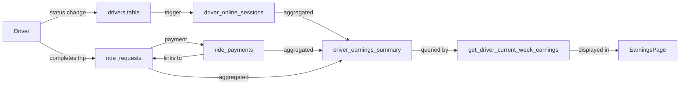

# Earnings Page Database Implementation

## Summary

Created comprehensive database structure for driver earnings tracking with automatic session management and payment method breakdown.

## Database Tables Created

### 1. driver_online_sessions
Tracks when drivers go online and offline for accurate online time calculation.

**Key Features:**
- Automatically starts session when driver status changes to `active`
- Automatically ends session when driver status changes to `inactive` or `on_trip`
- Calculates session duration in minutes
- Helper functions: `start_driver_online_session()`, `end_driver_online_session()`

### 2. driver_earnings_summary
Pivot table aggregating all driver earnings data for efficient querying.

**Key Features:**
- Aggregates earnings by payment method (cash, bank transfer, other)
- Tracks total trips and completed trips
- Calculates total online time from sessions
- Includes points and next payout information
- Function `get_driver_current_week_earnings()` returns all data needed for earnings page

### 3. ride_payments (Updated)
Added `ride_request_id` foreign key to link payments with specific trips.

**Changes:**
- Added `ride_request_id bigint not null` column
- Added foreign key constraint to `ride_requests` table
- Added index on `ride_request_id` for performance

### 4. driver_status_triggers
Automatic trigger to manage online sessions based on driver status changes.

**Behavior:**
- When driver goes `active`: starts new online session
- When driver goes `inactive` or `on_trip`: ends current online session
- Runs automatically on every driver status update

## Data Flow for Earnings Page



## Payment Method Breakdown

The earnings page displays:

1. **Total Balance** (`total_earnings`): Sum of ALL trip earnings regardless of payment method
2. **Cash Earnings** (`cash_earnings`): Earnings from trips paid by cash
3. **Bank Transfer Earnings** (`bank_transfer_earnings`): Earnings from trips paid by bank transfer
   - Includes next payout date and amount
4. **Other Earnings** (`other_earnings`): Earnings from any other payment methods

## Usage Example

To get current week earnings for a driver:

```sql
SELECT * FROM get_driver_current_week_earnings(driver_id);
```

Returns:
- `total_balance`: Total earnings from all payment methods
- `cash_earnings`: Cash payment earnings
- `bank_transfer_earnings`: Bank transfer earnings  
- `other_earnings`: Other payment method earnings
- `total_trips`: Number of completed trips
- `online_hours`: Hours spent online
- `online_minutes`: Remaining minutes
- `points`: Driver reward points
- `next_payout_date`: Scheduled payment date
- `next_payout_amount`: Amount to be paid

## Migration Notes

> [!IMPORTANT]
> **Existing Data**
> - Existing `ride_payments` records will need `ride_request_id` populated
> - Online time tracking starts from implementation forward (no historical data)
> - Run `refresh_driver_earnings_summary()` to populate initial summaries

> [!WARNING]
> **Breaking Changes**
> - `ride_payments` now requires `ride_request_id` (NOT NULL constraint)
> - Existing code creating payments must be updated to include ride request reference
